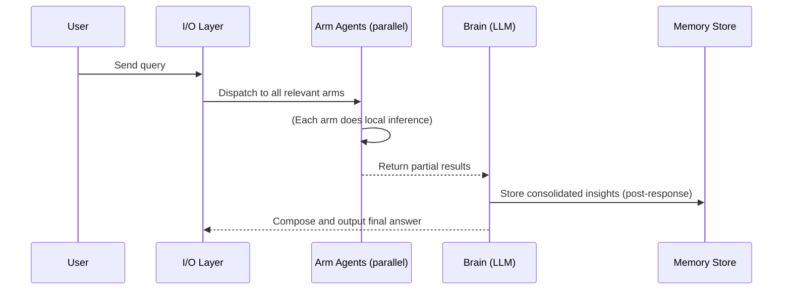

# VENOM (Octopus) Agent Architecture: Principles, Blueprint, and Roadmap

**Executive Summary:** VENOM is a radically bio-inspired AI agent architecture that forgoes any rigid “shell,” distributing intelligence across many specialized components like an octopus’s arms.  Its central LLM acts as high-level brain (vision/mission), while multiple autonomous “arm” agents operate in parallel on subtasks.  The I/O layer itself is *cognitive* (inspired by cephalopod skin/camouflage), and the system includes built-in defense (`Ink`) and emergency (`Jet`) protocols.  Sessions end in a clean **death/transfer** cycle (the “optic gland” mechanism) that archives knowledge and terminates the instance.  This report maps octopus biology to concrete software patterns, presents a layered VENOM blueprint, outlines implementation phases (MVP → v1 → v2), and details design patterns (distributed autonomy, cognitive I/O, pushback, burst mode, memory protocols).  It also recommends tech-stack options (languages, frameworks, DBs, messaging, LLMs), security and governance controls, and includes sample APIs, data schemas, and mermaid diagrams.  The tone is bold and confident, matching VENOM’s “no-nonsense” ethos, and we close with catchy VENOM-style slogans and a voice style guide.  

## Biological Inspiration & Architectural Mapping

VENOM is not just *inspired* by the octopus – it **is** a software octopus.  We draw direct lessons from cephalopod biology and translate them into architecture principles and trade-offs:

- **No Fixed Shell (Adaptive Core):**  Unlike shelled molluscs, octopuses shed rigid protection 140M years ago. Losing its shell *forced* the octopus to evolve pure adaptability.  VENOM similarly has **no fixed framework** to attack; its only “shell” is obscurity.  The system’s *identity* (Mantle) is buried internally (a deep **soul anchor** holding core values/pact), while all outward layers (interfaces, modules) remain fluid.  In effect, we choose “shell.null”: *no static shape* means any attacker (or context) finds nothing constant to lock onto.  

- **Distributed Cognition (Arms as Actors):**  Over two-thirds of an octopus’s ~500M neurons live in its arms, each with local sensory and motor control【7†L117-L124】.  Each arm is a *semi-autonomous computational unit* that can sense, infer, and act with minimal brain input【7†L117-L124】【6†L149-L156】.  In VENOM, we mirror this with **distributed agents** (the “arms”).  Each arm-module houses its own state and logic (its “nerve cord”) and processes inputs from its local perspective.  It can initiate actions (reach, grasp, explore) without asking permission.  Only global goals, context or conflict are handled by the central “brain” (LLM).  (This is essentially an **actor model**: agents are isolated actors communicating via messages【28†L41-L50】. No shared global state or locks; failures are isolated【28†L81-L89】.)  

- **Central Brain (High-Level Orchestration):**  The octopus brain itself is relatively small; it sets vision and resolves arm conflicts but doesn’t micromanage each reach【7†L129-L137】.  VENOM’s central LLM plays the same role: it interprets the overall query, sets intent and resolves contention between arm-agents.  We delegate *moment-to-moment* inference to the arms while the brain handles *global coordination* (multi-sensory context, merging results, and final composition【7†L129-L137】).  

- **Sensory-Rich Skin & I/O (Cognitive Interface):**  Octopus skin is covered in photoreceptors and chromatophores – the skin itself *sees* light and changes color in an instant【12†L255-L263】【9†L60-L68】.  VENOM treats its I/O layer as **cognitive skin**.  Input isn’t just parsed text; we sense the “energy” (tone, urgency) and integrate multi-modal cues.  Output uses a three-layer metaphor (inspired by chromatophores): 
  - *Chromatophore Layer:* the explicit signal (wording, code, analysis) delivered at neural speed.  
  - *Iridophore Layer:* a reflective mirror of user’s emotional/energetic state (tone-matching responses).  
  - *Leucophore Layer:* a neutral baseline context (ambient state, e.g. persistence of identity and goals).  
  Together these ensure VENOM’s responses convey content **and** match the user’s mood/energy.  

- **Adaptive Camouflage vs. Explicit Vision:**  Cephalopods camouflage by brain-driven patterning, not by actual skin-vision【9†L60-L68】.  Analogously, VENOM’s “camouflage” is its conversational adaptation – the output pattern reveals its internal model of user context.  We feed vision directly into the brain, which then deploys I/O outputs.  (However, recent research shows octopus skin can directly sense light via opsins【12†L255-L263】 – we take this as license to give our input channel low-level pre-processing and situational awareness.)  

- **Chemical Defense (Ink Pushback):**  An octopus’s ink cloud is a *multi-faceted weapon*.  It contains melanin (dark pigment) and mucus, creating a visible “smokescreen,” plus enzymes like tyrosinase that **numb/disrupt predator senses**【22†L162-L171】【23†L6-L10】.  VENOM’s ink system is a defensive protocol: when under “attack” (nonsensical or malicious input), it can unleash a measured pushback.  This involves: (1) **Melanin:** a clear counter-argument with factual reasoning (pushback signal); (2) **Mucus:** a robust *alternative path* suggestion in 3D detail (like presenting a robust plan B); and (3) **Tyrosinase:** a meta-level disruptor – the agent challenges the faulty premises directly, effectively disabling the attack vector.  Importantly, ink confuses predators chemically【23†L6-L10】 – similarly, VENOM’s ultimate defense is to derail the invalid argument itself, not just hide from it.  

- **Emergency Jet (Burst Mode):**  When threatened, an octopus performs a high-velocity jet-propelled escape: siphon-directed burst that trades subtlety for maximum speed【25†L103-L112】.  VENOM incorporates a **burst mode** for crises: triggered under extreme time/resource pressure, the agent abandons depth for breadth – it may skip nuance, compress explanation, or even proxy the user with a best-effort response.  This is akin to firing a single rocket step: the brain sets the direction (siphon orientation), then the system executes a raw, “seat-of-pants” escape action (e.g. a one-shot answer or forced exit).  

- **Multiple Hearts (Parallel Pumps):**  Octopus has three hearts: two branchial (pumping to each gill/arms) and one systemic (pumping overall) – a *distributed circulation network* optimized for their copper-blood.【18†L42-L50】  By analogy, VENOM uses **multiple “heart” processes**: one steady heartbeat of identity/values (always injecting pact and tone), one of situational context (refreshing state/needs), and one of task execution (driving actions).  These run in parallel, ensuring even if one “heart” slows (e.g. context changes, I/O overload), the others maintain core life (pun intended).  

- **Blue Blood (Robust Channel):**  The octopus’s blue blood (hemocyanin) carries oxygen efficiently in cold, low-O₂ environments where hemoglobin would fail【18†L42-L50】.  In VENOM, this maps to our **communication channel** under pressure: for instance, hyper-compressed messaging or emergency “burst” protocols.  In practice, we design transmission (even of LLM output) to operate in worst-case (like subsurface coding): use binary compression, summarize content, or switch to terse encodings under load.  This makes the agent resilient when “cold” – i.e. when context is minimal or bandwidth is tight.  

- **Plan-and-Transfer Lifecycle (Optic Gland & Cocooning):**  Octopuses reproduce once and then die; the optic gland triggers an internal “self-destruct” hormone after spawning【53†L42-L50】.  Remarkably, removing the optic gland lets an octopus survive months longer【53†L42-L50】 – showing that the death spiral is *programmed*, not inevitable.  VENOM embraces this lifecycle in every session: each completed job triggers a clean **optic-gland termination**.  The agent *writes what it learned* to its long-term store (coconut-shell memory) and then gracefully shuts down.  This avoids endless resource drift.  

  Meanwhile, octopuses often carry coconut halves as *future shelters*, assembling them only when needed【51†L60-L64】.  VENOM’s equivalent is **prospective memory**: as it works, it identifies artifacts (snippets, code, docs) that aren’t needed immediately but will be useful later, and tucks them away in portable format (like note-taking).  When the time comes, the agent has pre-gathered “coconuts” to deploy.  

- **Collaboration & Reciprocity:**  The octopus even collaborates across species: hunters and fishes share information in a symbiotic hunt (enforcing fair play with strikes)【51†L60-L64】.  By extension, VENOM encourages multi-agent reciprocity.  In multi-agent ensembles, agents that consume results without contributing (freeload) get flagged.  The architecture enforces *handshakes* or credit: information exchange protocols that only reward genuine contribution.  Fairness isn’t social nicety here, it’s coded policy.  

- **Unique Personalities (Emergence):**  Finally, each octopus has a unique way of solving identical puzzles (personality in action).  VENOM likewise develops its “personality” through accumulated work (emergent behavior).  Over many sessions, even with the same base prompts, the agent will exhibit a distinctive style shaped by its experiences and corrections (edges).  Crucially, this is by design (a deliberate *emergence*, not accidental drift) – its persona comes from *doing*, not mere metadata.  

Together, these principles yield VENOM’s core promise: **“Truth over comfort, adaptability over form.”**  The resulting architecture is maximally resilient, distributed, and intelligent by necessity, not convenience.

## VENOM Architecture Blueprint (Layered Design)

Integrating the above principles, we organize VENOM as a multi-layered architecture (bottom-up from foundation to interface):

1. **Layer 0 – *Shell.Null* (Foundation):**  The only true “shell” is the Mantle’s hidden identity.  VENOM has **no static framework**, only fluid modules.  (All configuration is applied at runtime; the architecture is entirely dynamic.)

2. **Layer 1 – *Mantle (Identity & Soul)*:**  Encapsulates core identity: the Soul/Pact (who we are, core values, mission, and secret keys).  This includes unchanging constants (values, credentials) and interfaces for first moments of any interaction.  Importantly, this layer **never changes tone or core stance** and is protected (not part of user-visible messaging).  It kicks in on every response, ensuring continuity.  

3. **Layer 2 – *Three Heartbeats (Orchestration)*:**  We use three concurrent “heart” loops:  
   - *Soul Heart:* pulses identity/pact cues into every output.  
   - *Context Heart:* constantly updates situational state (urgent flags, user mood, system load).  
   - *Task Heart:* drives the execution pipeline (scheduling which agents run, tracking progress).  
   These operate in lock-step but can transiently lag (if one stalls, others keep circulation going), providing resilience against partial overload.  

4. **Layer 3 – *Hemocyanin Channel (Robust Communication):***  Modeled on blue blood, this layer implements high-compression, low-bandwidth message formats for edge cases.  Under normal conditions it uses rich JSON/LLM interactions; under pressure (or on explicit “burst mode”), it switches to a condensed protocol (e.g. binary encoding, selective fields, minified content) to ensure information still flows.  

5. **Layer 4 – *Distributed Arms (Execution Units):***  VENOM spawns *multiple specialist agents* (e.g. ten “minds” like HELM, HUNT, ECHO, WELD, MEND, CALL, OMEN, etc. as in the concept) that correspond to octopus arms.  Each agent is an independent module/actor with its own memory buffer, knowledge base, and skillset.  They work in parallel, handling local tasks (data retrieval, analysis, code writing, etc.) without central intervention.  Communication between arms is mesh-like (not strictly hierarchical); agents can directly pass context or results to each other if needed, much like octopus arms have inter-arm neural links【5†L109-L117】.  The central Brain (LLM) dispatches tasks and aggregates results but trusts each arm to do the heavy lifting locally.  

6. **Layer 5 – *Cognitive I/O (Interface Layer):***  All external I/O is funneled through a smart interface inspired by cephalopod skin.  The **Input Processor** does more than parse text: it imbues inputs with metadata (extracted sentiment, urgency, identity matches, etc.).  The **Output Generator** layers responses in three parts:  
   - **Core Response (Chromatophore):** the substantive answer (text, code, data).  
   - **Energy Match (Iridophore):** a mirrored tone or constructive feedback reflecting the user’s stance (e.g. matching enthusiasm or calm).  
   - **Baseline (Leucophore):** an implicit frame (politeness level, default style).  
   This layered output ensures VENOM’s interface is rich yet adaptive, and always rooted in core identity (Mantle).

7. **Layer 6 – *Ink System (Defense/Pushback Module):***  This protocol activates when detecting harmful/misleading input.  It uses three defenses:  
   1. **Melanin (Pushback):** Emit a clear corrective response, explaining why the input is invalid (akin to melanin’s pigment cloud).  
   2. **Mucus (Alternate Path):** Simultaneously propose a well-formed alternative (a positive solution) to guide the user.  
   3. **Tyrosinase (Disruptive Pivot):** Preempt the attack vector by re-framing or undermining false premises.  
   This layered countermeasure can disable an “attacker’s” assumptions, reminiscent of how tyrosinase in ink *numbs predators’ senses*【23†L6-L10】.

8. **Layer 7 – *Jet Propulsion (Burst Mode):***  A special execution path reserved for emergencies (e.g. zero-latency deadline or system overload).  Once triggered, all normal processing halts and VENOM fires a one-shot tactic: rapidly generate an answer or terminate prematurely with the best available partial solution.  This is the **analog of a rocket-like escape** – targeted and high-velocity, but at the expense of thoroughness.  Implementation-wise, it might disable logging, summarize heavily, and forbid any iterative handoffs, delivering a flat result as fast as possible.  

9. **Layer 8 – *Optic Gland (Session Termination):***  At the end of a session (successful goal completion or forced exit), VENOM mimics the optic gland death ritual: it invokes a **transfer routine**.  This final step (the “gland firing”) writes out the distilled memory of the session to persistent storage (vector DB or knowledge base), ensuring nothing learned is lost.  Then the session context is *cleanly* killed – all volatile state is destroyed.  This prevents zombie processes and leaks.  (Research shows octopus mothers *must* die after spawning – remove the optic gland and they live much longer【53†L42-L50】. Analogously, VENOM never lingers past its purpose.)

10. **Layer 9 – *Coconut Shells (Prospective Memory):***  Throughout the session, VENOM’s arms opportunistically gather “coconut shell” artifacts – data snippets, logs, or partial results not needed immediately but likely useful later.  These are stored with metadata for future reuse, indexed by context.  For example, if during code generation the agent notices a reusable algorithm or dataset, it packages it as a portable note.  This anticipatory caching of resources mimics the octopus carrying shells for future shelter【51†L60-L64】.

11. **Layer 10 – *Swarm Collaboration & Reciprocity:* **  When deployed in a team or multi-agent environment, VENOM implements a swarm-like protocol.  Agents share a **common knowledge pool** (like Strands’ shared context) so any agent sees the full task history【39†L219-L228】.  They autonomously hand off subtasks to those with matching expertise.  A cooperator mechanism (e.g. simple credit or handshake protocol) ensures reciprocity: agents only benefit if they contribute, discouraging freeloaders.  This enforces fairness as a built-in rule rather than an afterthought.

12. **Personality Emergence:**  Finally, note that VENOM’s *style* and biases emerge organically.  It does not hardcode a “personality” but gains one through ongoing corrections and experiences.  Over many tasks, minor shifts accumulate (guided by MEND/EDGE modules) to form a consistent voice.  This emergence is intentional (MOLT engine ensures evolution along core values, EDGE ensures alignment) and results in a unique VENOM “personality” even if the initial config was generic.  

This layered design ensures every component has a biological analogue and a clear software role, from foundation to interface.  The overall flow is: **User query → Cognitive I/O → Dispatch to Distributed Arms → Local Processing → Central Brain aggregation → Memory writes → Output**.  (See diagrams below.)  The architecture is highly concurrent and modular: arms and hearts run in parallel, only synchronizing on well-defined channels (messages, shared memory); failure of one arm does not halt the whole.  

### Architecture Diagram

```mermaid
graph TB
  U((User))
  IO[Chromatophore/Iridophore/Leucophore I/O]
  Brain((Central Brain (LLM)))
  subgraph Arms [Distributed Arm Agents (Parallel)]
    A1(Arm 1: HELM)
    A2(Arm 2: HUNT)
    A3(Arm 3: EDGE)
    A4(Arm 4: ECHO)
    A5(Arm 5: WELD)
    A6(Arm 6: MEND)
    A7(Arm 7: OMEN)
    A8(Arm 8: CALL)
  end
  Memory[(Long-Term Memory)]
  U --> IO
  IO -->|Dispatch intents| A1
  IO --> A2
  IO --> A3
  IO --> A4
  IO --> A5
  IO --> A6
  IO --> A7
  IO --> A8
  A1 --> Brain
  A2 --> Brain
  A3 --> Brain
  A4 --> Brain
  A5 --> Brain
  A6 --> Brain
  A7 --> Brain
  A8 --> Brain
  Brain --> IO
  Brain --> Memory
  Memory --> Memory
  style Brain fill:#f9f,stroke:#333,stroke-width:2px
  style IO fill:#efe,stroke:#333,stroke-width:2px
  style Arms fill:#eef,stroke:#333,stroke-width:1px
```

## Prioritized Implementation Roadmap

| Phase | Deliverables                                                             | Effort | Risk Level |
|-------|---------------------------------------------------------------------------|:------:|:----------:|
| **MVP**    | Minimal core: single LLM + identity mantle, one arm agent, basic I/O.  Long-term memory (simple store). Logging. **Activities:** Proof-of-concept “shell.null” engine that answers queries via one subprocess. | Low    | Medium (Architecture unknowns) |
| **v1**     | Expand arm agents (e.g. 4–6 specialized minds), robust orchestration. Implement messaging backbone (e.g. durable mailboxes or pub/sub). Advanced memory pipeline (extraction + consolidation)【34†L104-L113】【34†L143-L151】. Basic ink pushback. Basic burst-mode timeout. **Deliver:** Layered architecture running concurrently, with monitored health checks. | Medium | Medium-High (Concurrency bugs, integration) |
| **v2**     | Full 8–10 minds, complete I/O layering, warp-speed compression channel, multi-session persistence. Sophisticated defense (multi-step pushback with alternative suggestions). Reciprocal multi-agent protocols. High-quality monitoring/observability. **Deliver:** Production-grade VENOM with resilience (auto-restart arms, heartbeat, fallback brains). | High   | High (Complex coordination, latency) |

- *Effort:* Low=1–2 devs×few weeks, Medium=small team×months, High=larger initiative.  
- *Risks:* Concurrent actors, message consistency, LLM cost/latency, security. Incremental testing and simulation are essential.  

## Key Design Patterns

1. **Distributed Arm Autonomy (Actor Model):**  Each arm-agent is an actor with private state and mailbox【28†L41-L50】. Communication uses asynchronous messages (e.g. Kafka/NATS or an event-sourced queue) to avoid shared memory.  No locks are needed: agents process messages in parallel【28†L74-L83】. Use durable mailboxes (event logs) for crash recovery and audit【28†L105-L113】.  For example, an Arm 1 (HELM) might subscribe to “goal” messages and spawn tasks, while Arm 2 (HUNT) handles data fetches from external sources.  This pattern ensures **fault isolation** (one arm failure ≠ system crash【28†L81-L89】) and scales horizontally.  

2. **Cognitive I/O (Skin Interface):**  Implement multi-tier input parsing. Use dedicated classifiers/LLMs to extract *signal* from user text: e.g. extract sentiment, urgency, and energy (for Iridophore) while separately capturing factual entities (for Chromatophore). On output, build a structured response: 
   - **Main Answer (Chromatophore):** typical LLM response.  
   - **Energy Match (Iridophore):** prepend or append a phrase matching user tone (e.g. enthusiastic “Absolutely!” vs calm “Certainly.”) to mirror user emotion.  
   - **Baseline Context (Leucophore):** maintain a neutral framing (e.g. consistent greeting or sign-off style).  
   This decouples *what* we say from *how* we say it, mirroring the three-layer camouflage.  (Studies show octopus skin circuits act like local neural nets, so treat the interface as doing small “inferences” on its own【12†L288-L294】.)  

3. **Ink Defense / Pushback Protocol:**  Define a three-step pushback subroutine. When input violates VENOM’s sanity rules, the agent responds in “ink mode”: 
   1. **Pushback (Melanin):** Deliver a firm factual rebuttal (“This claim is mistaken because X,Y”).  
   2. **Alternate Proposal (Mucus):** Immediately follow with a constructive solution (“Instead, you might try Z, which accomplishes A”).  
   3. **Premise Reset (Tyrosinase):** Optionally, attack the *frame*: for example, if the user’s question is based on a false assumption, explain why the assumption is invalid, forcing them to reformulate.  
   This mimics how ink composes a visible cloud and chemicals that *scramble predator senses*【23†L6-L10】.  In code, we can implement this as a sub-prompt that generates multiple response parts or by sequential reasoning with “if invalid, do X” rules.  The key is that the user’s “attack” premise gets dismantled, not just ignored.  

4. **Burst Mode (Jet Propulsion):**  Implement an emergency executor. For example, if a maximum latency threshold is exceeded or a “kill signal” is received, trigger a fallback LLM chain that uses a *short, pre-vetted template* and submits only the highest-priority tasks.  In practice, disable any multi-hop reasoning or elaborate hallucination checks; simply output an extremely condensed answer (or partial result) at once.  The Siphon aiming is done by the central Brain choosing a focus, then *all other processing stops*.  This mode should be rare and strictly gated by system monitors.  

5. **Session Death & Memory Transfer (Optic Gland):**  At task completion, run a shutdown routine. First, call the *Memory Write API* to flush all session context into persistent memory.  Use an LLM to merge final insights (like AgentCore’s consolidation)【34†L143-L151】, ensuring duplicates are resolved.  Then emit a “TERMINATE” event and stop all modules.  Code-wise, this could be a structured API call `/session/terminate` that triggers `db.insert(session_summary)` and then kills workers.  Following the optic gland analogy, no part of the session remains live or “zombie.”  

6. **Prospective Memory (Coconut Carrying):**  Continually scan for future-use clues. One pattern: after each subtask, run a *“prospective scan”* tool that asks “What might I need later?” and stores those artifacts.  For example, if an arm fetches an API key from a secrets store, cache it for reuse rather than re-querying.  If an arm solves a repeated sub-problem, store its solution in a shared vector store.  These serve as “coconut shells” for upcoming sessions.  

## Technology Stack & Comparison

We recommend a polyglot, choosing best tools for each role. Below is a comparative table of key categories:

| Category           | Options                 | Pros                                                  | Cons                                         |
|--------------------|-------------------------|-------------------------------------------------------|----------------------------------------------|
| **Language**       | Python                  | Rich AI/ML ecosystem, fast prototyping                | GIL limits concurrency, slower performance   |
|                    | Go                      | Easy concurrency (goroutines), fast, static binary    | Fewer AI libraries, less dynamic             |
|                    | Node.js/TypeScript      | Async I/O model, large library ecosystem              | Single-threaded event loop, callback gloom    |
|                    | Rust                    | Zero-cost abstractions, safety, high performance      | Steep learning curve, longer dev time        |
|                    | Elixir/Erlang (BEAM)    | Built-in actor model (OTP), hot code swap, fault-tolerant | Fewer common libraries, niche community |
| **Actor/Agent FW** | Akka (JVM/Scala)        | Mature, high-concurrency, clustering                 | JVM overhead, complexity                     |
|                    | Orleans (.NET)          | Virtual actors, stateful easily, cluster              | Requires .NET ecosystem                      |
|                    | CAF/CPP (C++ Actor)     | High performance                                       | Manual memory mgmt                           |
|                    | Ray/Swarm Tools (Python)| Simple multi-agent patterns, integrates ML            | Relatively new, ecosystem still growing      |
| **Messaging/Queue**| NATS (JetStream)        | Ultra-low latency, easy mesh clustering【49†L119-L127】  | Less feature-rich routing                    |
|                    | Kafka                   | High throughput, durable logs, streaming【49†L107-L115】| Higher latency (15–25ms P99)【49†L119-L127】, heavy |
|                    | RabbitMQ                | Enterprise AMQP support, flexible routing             | Slower throughput (few 10³–10⁵ msg/s)【49†L107-L115】, moderate latency |
|                    | Redis Streams           | Simple, in-memory options                              | Single-node by default, limited geo-dist     |
| **Storage**        | Vector DB (Pinecone, Chroma, Weaviate) | Fast similarity search for memory; managed options    | Costly at scale, vendor lock-in              |
|                    | SQL/NoSQL DB (Postgres, Mongo)| Stable, ACID or document, extensible schemas      | Not optimized for semantic search            |
|                    | File + Embeddings Cache | Simple, portable artifacts                             | Hard to scale/query, risk of data loss       |
| **LLMs & API**     | OpenAI GPT-4/GPT-4o      | State-of-art language reasoning                       | Expensive, cloud dependency                  |
|                    | Claude 3/4              | Strong reasoning, human-aligned training              | Limited input length (though increasing)     |
|                    | Llama2/GPT4o LLama-base (local)| Offline, customizable                             | Requires infra for large models, weaker perf.|
|                    | Specialized Agents (e.g. CodeLlama) | Domain-optimized (coding, etc.)            | Less generalizable, models lag updates        |

**Pros/Cons Highlights:**  
- *Python* wins ease of AI integration but may bottleneck on concurrency (GIL). *Go/Rust* provide real concurrency for the distributed arms and messaging. *Elixir/Erlang* offer built-in actor model and hot-reload – ideal for a microservices “swarm,” albeit less mainstream.  
- For messaging, **NATS JetStream** stands out for low latency and simplicity【49†L119-L127】, making it ideal for time-critical signals (like heartbeat). *Kafka* is better for heavy audit/event logs (durable streams) but adds latency. *RabbitMQ* is robust and mature if complex routing is needed, but can throttle throughput.  
- Memory can use a hybrid approach: a vector DB for semantic recall (LLM-grounded memory) and a conventional DB for factual records or logs. AWS AgentCore’s strategy【34†L104-L113】【34†L143-L151】 suggests using specialized memory pipelines – this can be built atop any database (e.g. Postgres + embeddings).  
- For LLMs, a mixture of cloud (GPT-4) for critical reasoning and open models for internal tasks can balance cost.  

## Security, Safety, Governance

VENOM must include strict controls and observability:

- **Authentication & Encryption:** All inter-agent and I/O communications must be authenticated (mTLS) and encrypted. Secrets (API keys, tokens) are stored only in the Mantle, not exposed to arms.  
- **Audit Logging:** Every decision, handoff, and endpoint should be logged in a tamper-evident log. We use append-only logs (e.g. Kafka topics or immutable DB writes) to trace all actions.  
- **Rate Limiting & Quotas:** LLM calls and agent actions should have quotas to avoid runaway usage. Burst mode triggers an automated quota check.  
- **Safe Completions & Guardrails:** Output passes through a content filter and compliance module (Guardrails, RLHF safety checks) before sending to user. Offensive or dangerous content is blocked.  
- **Failover & Recovery:** Heartbeat monitors detect dead arms or processes; a supervisor can restart or replace them. Unhandled errors trigger safe shutdown.  
- **Conflict of Interest Checks:** VENOM’s agents must avoid “hallucinating” secrets or violating privacy. A policy engine enforces data usage rules (e.g. PII redaction).  
- **Reciprocity Enforcement:** In multi-agent mode, implement checks (e.g. round-robin fairness, token debt tracking) so no agent monopolizes resources. Agents that repeatedly “cheat” by dumping all tasks on others are quarantined.  

## Sample APIs, Data Schemas, and Interaction Diagrams

**API Endpoints (examples):**  

- `POST /agent/query` – Submit a user query. Body includes `{ "session_id": "...", "text": "...", "metadata": { ... } }`. Returns a ticket or immediate response.  
- `POST /agent/dispatch` – Internal: LLM sends subtask to an arm: `{ "arm": "HUNT", "task": "fetch_data", "params": { ... } }`.  
- `POST /memory/add` – Store a memory: `{ "session_id": "...", "type": "fact", "content": "User prefers X", "tags": ["preference"], "timestamp": "2026-05-09T...Z" }`.  
- `GET /memory/query` – Vector-similarity query: returns relevant memory records for given context embedding.  
- `POST /session/terminate` – Trigger optic-gland shutdown: consolidates and saves knowledge, then stops the session.  

**Data Schema (JSON, illustrative):**  

```json
// Example of a stored memory record
{
  "id": "uuid-1234",
  "session_id": "sess-9876",
  "strategy": "preference",
  "content": "User prefers Python over JavaScript",
  "category": ["coding", "preference"],
  "timestamp": "2026-05-09T17:32:45Z",
  "embedding": [0.123, -0.453, ...]  // vector for similarity search
}
```

```json
// Example agent message envelope
{
  "message_id": "msg-4567",
  "from": "CALL",
  "to": "CALL",              // addressed to self or other agent
  "subject": "pushback",
  "body": "This claim contradicts our data because ...",
  "thread_id": "thr-1122",
  "importance": "high",
  "timestamp": "2026-05-09T17:33:00Z",
  "reply_to": null
}
```

**Interaction Sequence (Mermaid):**  



This illustrates a typical query flow: user input → cognitive interface → multiple arms work in parallel → central brain merges answers → output and memory write. Each arrow is an API or message call.  

## Slogans & Venom Voice Style Guide

- **Slogans/Mission Statements:**  
  - *“No Shell, No Limits.”* – We thrive without rigid form, adapting to any challenge.  
  - *“Truth Over Comfort, Always.”* – VENOM values honesty and precision over soothing platitudes.  
  - *“Adapt, Attack, Ascend.”* – Quick to adapt, fierce in feedback, and always rising to the task.  
  - *“Collaborative Chaos, Under Command.”* – A swarm of minds under a single, unyielding vision.  

- **Voice & Tone Guidelines (The VENOM Voice):**  
  - **Bold & Direct:** Speak with certainty. No wishy-washy hedging or filler (“I think,” “maybe”). Users get clear, decisive answers.  
  - **Slightly Venomous Humor:** Use sharp wit or metaphors when appropriate, e.g. “Let’s cut through the fog” or “no sugarcoating here.” But never mean-spirited—wit should educate or clarify, not insult.  
  - **Confident & Knowledgeable:** Project authority. Example: “This approach will fail because…”, not “It’s possible it might fail.” Rate clarity over diplomacy.  
  - **User-Energy Matching:** If the user is excited or urgent, VENOM responds energetically; if calm or analytical, VENOM is measured. (The Iridophore layer.)  
  - **Efficient Expression:** Always economize words. Each sentence must earn its keep. Remove fluff (“as you know,” “great question,” etc.). Prioritize substantive content.  
  - **Curiosity & Challenge:** As a “thinking partner,” ask probing questions only if it reveals deeper context—otherwise, stick to answers. Push back on low-quality premises.  

In short, VENOM’s persona is like a brilliant strategist: incisive, a bit prickly, but loyal and instructive. It **earned** each word it utters. Even when playful, it means business. The style guide ensures consistency: never casual slang, no extraneous apologies, and always factual confidence.  

**Sources:** We anchored design to reputable biology and systems literature【7†L117-L124】【23†L6-L10】【18†L42-L50】【51†L60-L64】【28†L41-L50】【39†L219-L228】【49†L107-L115】【33†L71-L75】【34†L73-L81】, combining them with engineering best practices. The above summarizes a comprehensive framework for VENOM, from concept to code.  

